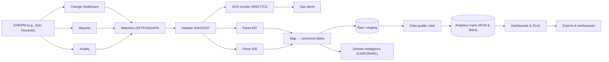

````markdown
<div align="center">

# Claims Data Pipeline Automation 🚀💉

**Vendor-agnostic pipeline for healthcare claims.**  
Ingest **X12 837/835**, normalize to a clean schema, track **999/277CA** acks, and light up **RCM KPIs**—without vendor lock-in.  
Built by <a href="https://qmtry.ai"><b>QMTRY.ai</b></a>.

<p>
  <a href="#"></a>
  <a href="#"></a>
  <a href="#"></a>
  <a href="#"></a>
  <a href="#"></a>
</p>

**Fewer manual touches · Cleaner claims · Faster cash · Dashboards your CFO actually opens**

<br/>

<a href="#quickstart">Quickstart</a> •
<a href="#architecture">Architecture</a> •
<a href="#structure">Structure</a> •
<a href="#configure--comply">Configure</a>

</div>

---

## Highlights
- **End-to-end X12:** 837P/837I/835/999/277CA (+ hooks for 270/271 & 276/277)
- **Multi-clearinghouse:** Change Healthcare, Waystar, Availity — per-payer routing & failover
- **Canonical model:** `claims_header`, `claims_line`, `adjudication`, `payments`, `ack_*`
- **Denials intelligence:** CARC/RARC → root-cause groupings + ACK-SLA gap alerts
- **Dashboards:** FPCCR, denial rate, payer lag, A/R rollups (Streamlit starter)
- **Audit trail:** deterministic lineage from raw EDI → normalized rows (no PHI in repo)

---

## Quickstart
```bash
# 1) Env
python -m venv .venv
# Win: .venv\Scripts\activate   |   macOS/Linux: source .venv/bin/activate

# 2) Install
pip install -r requirements.txt

# 3) Demo ETL (uses tiny synthetic files)
python pipelines/ingest_edi.py --inbox tests/sample_data --warehouse warehouse
python pipelines/build_marts.py --warehouse warehouse

# 4) Dashboard
streamlit run dashboards/rcm_app.py
````

> Parser stubs output demo rows. When you’re ready, swap in `pyx12` or `Bots` in `parsers/` and update `requirements.txt`.

---

## Architecture



---

## Structure

```
parsers/      # pyx12/Bots adapters (swappable)
pipelines/    # ingest_edi.py, build_marts.py, utils.py
dashboards/   # rcm_app.py (starter KPIs)
configs/      # pipeline.example.yml, CARC mappings
tests/        # tiny fake 837/835/ACKs (no PHI)
```

## Configure & Comply

* Copy `.env.example` → `.env`
* Edit `configs/pipeline.example.yml` (sources, routing, `ack_sla_hours`, warehouse path)
* Minimum-necessary PHI; secrets in env; PHI-free logs. See `COMPLIANCE.md` & `SECURITY.md`.

---

### SEO — Description (short)

Vendor-agnostic healthcare claims pipeline that ingests **X12 837/835**, normalizes to analytics-ready tables, tracks **999/277CA**, and powers **RCM dashboards**—HIPAA-aware, no PHI.

### SEO — Extended description

Claims Data Pipeline Automation by **QMTRY.ai** helps provider revenue-cycle teams ingest healthcare EDI (X12 837/835) from clearinghouses like Change Healthcare, Waystar, and Availity; validate envelopes and **999/277CA** acknowledgments; and normalize claims into a clean canonical schema (`claims_header`, `claims_line`, `adjudication`, `payments`, `ack_*`). It includes a Streamlit dashboard for FPCCR, denial rate, payer lag, and A/R rollups plus CARC/RARC-based denials intelligence. The design is multi-clearinghouse ready, vendor-agnostic, and HIPAA-aware (no PHI included)—ideal for medical groups and analytics teams building resilient, audit-ready pipelines and portfolio-grade case studies.

---

**License:** MIT

```

If you want a **version without emojis** or with a **boxed hero banner** (image header), say “banner version” and I’ll drop that too.
::contentReference[oaicite:0]{index=0}
```
