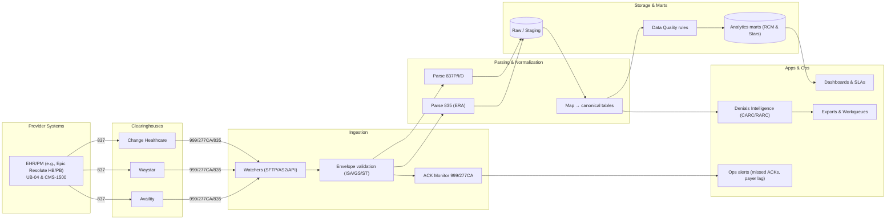

````markdown
# Claims Data Pipeline Automation 🚀💉

**Vendor-agnostic pipeline for healthcare claims.** Ingest **X12 837/835**, normalize to a clean schema, track **999/277CA** acknowledgments, and light up **RCM KPIs**—without vendor lock-in.  
Built by [QMTRY.ai](https://qmtry.ai).

---

## What You Get
- **End-to-end X12:** 837P/837I/835/999/277CA (+ hooks for 270/271 & 276/277)
- **Multi-clearinghouse:** Change Healthcare, Waystar, Availity — per-payer routing & failover
- **Canonical model:** `claims_header`, `claims_line`, `adjudication`, `payments`, `ack_*`
- **Denials intelligence:** CARC/RARC → root-cause, plus ACK-SLA gap alerts
- **Dashboards:** FPCCR, denial rate, payer lag, A/R rollups (Streamlit starter)
- **Audit trail:** deterministic lineage from raw EDI → normalized rows (no PHI in repo)

---

## Quickstart
```bash
python -m venv .venv && source .venv/bin/activate   # Win: .venv\Scripts\activate
pip install -r requirements.txt
python pipelines/ingest_edi.py --inbox tests/sample_data --warehouse warehouse
python pipelines/build_marts.py --warehouse warehouse
streamlit run dashboards/rcm_app.py
````

> Parser stubs output demo rows. When ready, swap in `pyx12` or `Bots` in `parsers/` and update `requirements.txt`.

---

## Architecture (Mermaid)



---

## Folders

```
parsers/      # pyx12/Bots adapters (swappable)
pipelines/    # ingest_edi.py, build_marts.py, utils.py
dashboards/   # rcm_app.py (starter KPIs)
configs/      # pipeline.example.yml, CARC mappings
tests/        # tiny fake 837/835/ACKs (no PHI)
```

## Configure

* Copy `.env.example` → `.env`
* Edit `configs/pipeline.example.yml` (sources, routing, `ack_sla_hours`, warehouse path)

## License

MIT — see `LICENSE`.

````

**Description (SEO, short)**
```text
Vendor-agnostic healthcare claims pipeline: ingest X12 837/835, normalize to analytics tables, track 999/277CA, and power RCM dashboards—HIPAA-aware, no PHI.
````

**Extended description (SEO)**

```text
Claims Data Pipeline Automation by QMTRY.ai helps provider revenue-cycle teams ingest healthcare EDI (X12 837/835) from clearinghouses such as Change Healthcare, Waystar, and Availity; validate envelopes and 999/277CA acknowledgments; and normalize claims into a clean canonical schema (claims_header, claims_line, adjudication, payments, ack_*). It ships with a Streamlit dashboard for FPCCR, denial rate, payer lag, and A/R rollups, plus CARC/RARC-based denials intelligence. The design is multi-clearinghouse ready, vendor-agnostic, and HIPAA-aware (no PHI included)—ideal for medical groups and analytics teams building resilient, audit-ready pipelines and portfolio-grade case studies.
```
